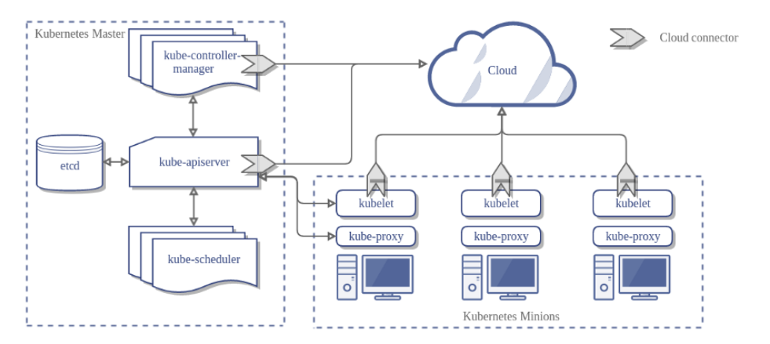

# Kubernetes Components and Workflow

## 1. Kubernetes Architecture

Kubernetes has two main parts:

### **Control Plane (Master Node)**
1. **API Server (`kube-apiserver`)** - The main entry point for all requests.
2. **etcd** - Stores cluster data and state.
3. **Scheduler (`kube-scheduler`)** - Assigns pods to nodes.
4. **Controller Manager (`kube-controller-manager`)** - Ensures the desired cluster state.

### **Worker Nodes (Minions)**
1. **Kubelet** - Runs and manages containers on the node.
2. **Kube Proxy** - Manages networking between pods.
3. **Container Runtime** - Runs the containers (Docker, containerd, etc.).

---

## 2. Kubernetes Workflow Example

### **Scenario:** Deploying a Web Application

### **Step 1: User Creates a Deployment**
- The user runs `kubectl apply -f deployment.yaml`.
- The request goes to the **API Server**.

### **Step 2: API Server Processes the Request**
- The API Server saves data in **etcd**.
- It informs the **Scheduler** that a new pod needs a node.

### **Step 3: Scheduler Assigns a Node**
- The Scheduler finds the best node for the pod.
- It sends the assignment to the **API Server**.

### **Step 4: Kubelet Starts the Pod**
- The **Kubelet** on the selected node runs the pod.
- The **Container Runtime** starts the container inside the pod.

### **Step 5: Kube Proxy Manages Networking**
- The **Kube Proxy** routes traffic to the new pod.
- The pod is now accessible via a service.

### **Step 6: Controller Manager Monitors the Pod**
- If the pod crashes, the **Controller Manager** creates a new one.

---

## 3. Real-Life Analogy
Think of Kubernetes as a restaurant:
- **Customer orders food** → (`kubectl apply` command)
- **Order received by the system** → (`API Server`)
- **Manager assigns a chef** → (`Scheduler` finds a node)
- **Chef prepares the food** → (`Kubelet` starts the pod)
- **Waiter delivers the food** → (`Kube Proxy` manages access)
- **If food is not good, a new dish is prepared** → (`Controller Manager` ensures availability)

