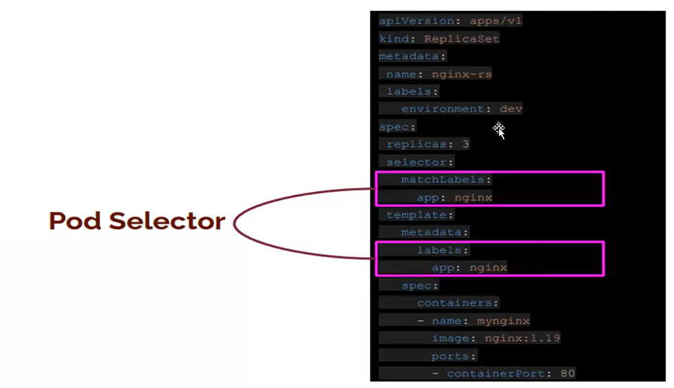

# Kubernetes Basics

## Part 1 - Setting up the Kubernetes Cluster

https://www.killercoda.com/courses/kubernetes/playground

- Check if Kubernetes is running and nodes are ready.(Day1)
 
- For worker node:
````bash
# Python ve pip kurulumu
wget https://bootstrap.pypa.io/get-pip.py
python3 get-pip.py

# Python paketlerinin kurulumu
pip install pyopenssl --upgrade
pip3 install ec2instanceconnectcli

# mssh kurulumu
sudo apt install -y mssh
````
- master
```bash
kubectl cluster-info
kubectl get node
```

## Part 2 - Basic Operations in Kubernetes

### Understanding Key Kubernetes Concepts

#### What is a Pod?
A Pod is the smallest deployable unit in Kubernetes. It represents a single instance of a running process in the cluster. Pods can contain multiple containers that share networking and storage.

#### What is a ReplicaSet?
A ReplicaSet ensures that a specified number of pod replicas are running at any given time. It helps maintain application availability by automatically replacing failed pods.

#### What is a Deployment?
A Deployment is a higher-level abstraction that manages ReplicaSets and provides declarative updates for pods and ReplicaSets. It allows rolling updates and rollbacks.

### Key Fields in Kubernetes YAML

#### `apiVersion`
Defines the Kubernetes API version being used. This is crucial because different versions may support different features.

#### `kind`
Specifies the type of Kubernetes object (e.g., Pod, ReplicaSet, Deployment).

#### `metadata`
Contains the name, labels, and annotations for identifying Kubernetes objects.

#### `labels`
Labels are key-value pairs attached to objects for organization and selection. They help in identifying resources within Kubernetes.

#### `spec`
The spec field defines the desired state of the object. It contains details such as the container image, ports, and replica count.

### Importance of Label Matching


Labels play a critical role in how Kubernetes objects interact. For instance:
- **Pods and ReplicaSets**: A ReplicaSet manages Pods based on label selectors. If the label in `.spec.selector.matchLabels` of the ReplicaSet does not match the labels in the Pod template, the ReplicaSet will not recognize the Pods.
- **Deployments and ReplicaSets**: Deployments use label selectors to manage ReplicaSets. If the labels are inconsistent, the Deployment will not correctly track and manage the ReplicaSets.

For example, in a ReplicaSet YAML:
```yaml
spec:
  selector:
    matchLabels:
      app: nginx
  template:
    metadata:
      labels:
        app: nginx
```
Here, the `matchLabels` field ensures that only Pods with the `app: nginx` label are managed by this ReplicaSet. This consistency is necessary for proper functioning.

## Part 2 - Basic Operations in Kubernetes (Continued)

- Show the names and short names of the supported API resources as shown in the example:
alias k=kubectl

|NAME|SHORTNAMES|
|----|----------|
|deployments|deploy
|events     |ev
|endpoints  |ep
|nodes      |no
|pods       |po
|services   |svc

```bash
kubectl api-resources
```

- To view kubectl commands:

```
kubectl help
```

- Get the documentation of `Nodes` and its fields.

```bash
kubectl explain nodes
```

- View the nodes in the cluster using.

```bash
kubectl get nodes 
```

### Pods

- Get the documentation of `Pods` and its fields.

```bash
kubectl explain pods
```

- create a pod using imperative way

```bash
kubectl run nginx --image=nginx
```

- List the pods.

```bash
kubectl get pods
```

- Create yaml file named `mypod.yaml` and explain fields of it.

```yaml
apiVersion: v1
kind: Pod
metadata:
  name: nginx-pod
  labels:
    app: nginx
spec:
  containers:
  - name: mynginx
    image: nginx
    ports:
    - containerPort: 80
```

- Create a pod with `kubectl create` command.

```bash
kubectl create -f mypod.yaml
```

- Use apply command this time and see the output message, apply command applies changes if any.

```bash
kubectl apply -f mypod.yaml
```

- List the pods.

```bash
kubectl get pods
```

- List pods in `ps output format` with more information (such as node name).
  
```bash
kubectl get pods -o wide
```

- Show details of pod.

```bash
kubectl describe pods/nginx-pod
```

- Show details of pod in `yaml format`.
  
```bash
kubectl get pods/nginx-pod -o yaml
```

- Delete the pod.

```bash
kubectl delete -f mypod.yaml
# or
kubectl delete pod nginx-pod

kubectl delete -f .
```

### ReplicaSets

- Get the documentation of `replicasets` and its fields.

```bash
kubectl explain replicaset
```

